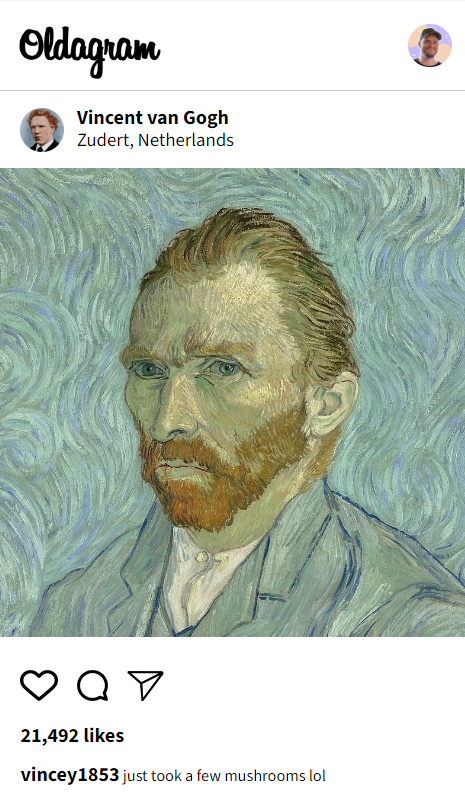

Simple exercise to css practice:

the exercise has some vanilla JS in order to generate contents from a js object

solo exercise from [Scrimba](https://scrimba.com/learn/frontend/solo-project-oldagram-co2274297820a9405442e3a2a)